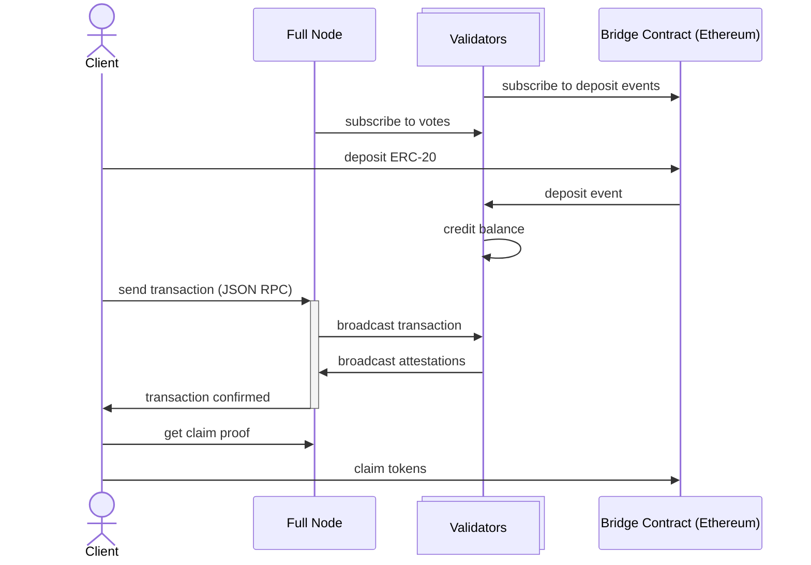

# Network Architecture

Pod Network consists of four types of entities: **clients**, **full nodes**, **validators**, and the **native bridge** on Ethereum.

## Clients

Clients submit transactions to full nodes via JSON-RPC using standard Ethereum tooling (`ethers.js`, `viem`, `web3.py`, `alloy`). After submission, the client receives a stream of attestations from the validator set. Once a quorum of attestations is collected, the transaction is final.

## Full Nodes

Full nodes are the entry point to the network. They accept JSON-RPC requests from clients, broadcast transactions to the validator set, and relay attestations back. Full nodes maintain a local view of the current state but do not participate in validation.

## Validators

Validators form the core of Pod's protocol. Each validator independently receives transactions, validates them, timestamps them, and signs an attestation. Validators do not coordinate with each other before attesting - they respond directly and in parallel. A transaction is final once the client collects attestations from a supermajority (4/5) of the validator set by stake.

Validators also observe deposit events from the native bridge contract on Ethereum and credit balances accordingly.

## Native Bridge

The Pod native bridge is a smart contract deployed on Ethereum. Users deposit ETH or ERC-20 tokens into the bridge contract, which emits deposit events. Validators observe these events and increase the user's balance on Pod. Withdrawals follow the reverse flow - the user initiates a withdrawal on Pod, and once finalized, can claim their tokens from the bridge contract on Ethereum.

See [Native Bridge](../native-bridge.md) for the full deposit and withdrawal flow.
