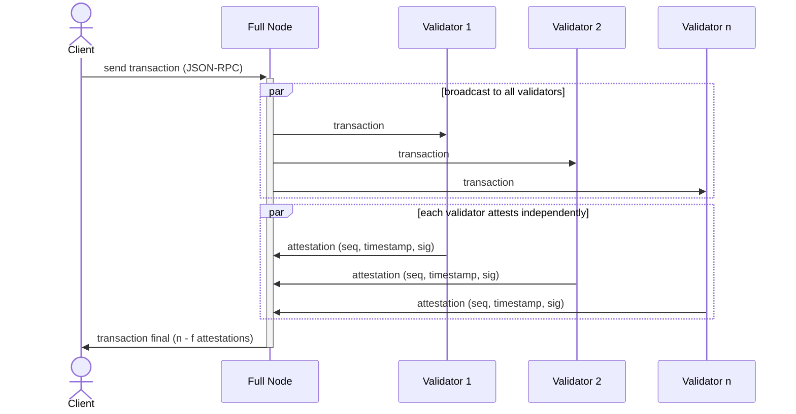

# Transaction Flow

In traditional blockchains, a transaction is sent to a mempool, picked up by a leader or sequencer, included in a block, and the block must then be confirmed through consensus. Pod skips all of this. A client sends a signed transaction to a full node, which broadcasts it to all validators. Each validator independently validates the transaction, appends it to its local log, and signs an attestation. The full node streams attestations back to the client. Once enough attestations are collected, the transaction is final.

This gives Pod two properties:

1. **Single round-trip confirmation** - a transaction is final after one network round trip (client → validators → client), with no multi-round coordination between validators.
2. **Responsiveness** - confirmation latency depends only on actual network delay, not on block intervals or timeout parameters. The client sends a transaction and receives a response, similar to querying an HTTP API.

## 1. Submission

The client signs a transaction and sends it to a full node via JSON-RPC. The full node broadcasts the transaction to all validators in the network simultaneously.

## 2. Validation and Attestation

Each validator independently receives the transaction and:

1. **Validates** the transaction - this includes verifying the client's signature, checking the nonce, ensuring sufficient balance, and any application-specific validation (e.g. order book rules).
2. Appends it to its local **temporal log** - a per-validator, totally ordered sequence of transactions.
3. Signs an **attestation** containing:
   * The transaction hash
   * A **sequence number** - the position of the transaction in this validator's temporal log
   * A **timestamp** - the validator's local time when the transaction was appended

The validator broadcasts its attestation to all other validators and full nodes. No validator waits for or communicates with other validators before attesting.

## 3. Finality

The full node streams attestations back to the client as they arrive. A transaction is **final** once it has collected **n - f** attestations from the validator set, where **n** is the total number of validators and **f** is the maximum number of Byzantine validators the network tolerates.

With a 5f + 1 validator set, this means a supermajority of 4/5 of validators by stake must attest for finality. Once this threshold is reached, the transaction cannot be reverted - even if the remaining validators are adversarial.

The collection of n - f attestations forms a **finality certificate** that is verifiable outside Pod. Any external system (a smart contract on Ethereum, a TEE enclave, a ZK circuit) can check the certificate to confirm a transaction was finalized on Pod without trusting a relay or intermediary.
